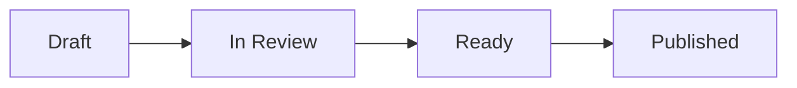

# Developer Handover: Phase 2 - Implement Docusaurus + Decap CMS Multi-Instance Documentation

**Document Version:** 1.0  
**Date:** January 13, 2026  
**Prepared For:** VA Design System Team  
**Phase 2 Goal:** Add Docusaurus + Decap CMS for multi-instance documentation and non-technical user editing

---

## Executive Summary

Phase 2 builds on the completed Phase 1 monorepo migration by adding Docusaurus + Decap CMS to enable:
- **Multiple documentation instances** (Design System, API, Team docs)
- **Visual editing interface** for non-technical users (Confluence replacement)
- **Unified documentation portal** at design.va.gov
- **Team autonomy** with CODEOWNERS and separate doc instances

**Estimated Time:** 3-4 weeks
- Week 1: Docusaurus setup + migration planning
- Week 2: Decap CMS integration + authentication
- Week 3: Pilot team onboarding
- Week 4: Testing, refinement, documentation

**Key Deliverables:**
- Docusaurus running alongside or replacing Jekyll
- Decap CMS admin interface at /admin
- Multi-instance doc configuration
- Pilot team documentation migrated
- Training materials for teams

---

## Phase 1 Recap - What We Built

✅ **Completed in Phase 1:**
- Monorepo structure in `component-library`
- Jekyll documentation site in `apps/docs/`
- Preserved Git history
- Working CI/CD pipelines
- Storybook integration

**Current Structure:**
```
component-library/
├── apps/
│   └── docs/                    # Jekyll site (Phase 1)
│       ├── src/
│       ├── _config.yml
│       └── package.json
├── packages/
│   ├── web-components/
│   ├── css-library/
│   ├── storybook/
│   └── core/
```

---

## Phase 2 Goals

### Primary Objectives

1. **Add Docusaurus** - Modern documentation framework with React support
2. **Integrate Decap CMS** - WYSIWYG editing for non-technical users
3. **Multi-instance Support** - Separate doc sections for different content types
4. **Pilot Team Migration** - Onboard 1-2 teams to test the workflow
5. **Maintain Jekyll** (temporarily) - Run both systems until full migration

### Success Criteria

✅ **Technical:**
- [ ] Docusaurus builds successfully in monorepo
- [ ] Decap CMS admin interface accessible at /admin
- [ ] Team can edit docs through CMS without Git knowledge
- [ ] Multiple doc instances work (Design System, Pilot Team)
- [ ] Search works across all documentation
- [ ] Component demos work in Docusaurus

✅ **User Experience:**
- [ ] Non-technical users can create/edit pages
- [ ] Approval workflow works (editorial workflow)
- [ ] Pilot team successfully publishes documentation
- [ ] Team feedback is positive (minimal friction)

---

## Implementation Strategy

### Option A: Run Docusaurus Alongside Jekyll (Recommended for Phase 2)

**Approach:** Keep Jekyll for existing design system docs, add Docusaurus for new content

**Pros:**
- ✅ Zero disruption to existing site
- ✅ Gradual migration path
- ✅ Easy rollback if issues arise
- ✅ Team learns Docusaurus with low risk

**Cons:**
- ⚠️ Two documentation systems to maintain
- ⚠️ Slightly more complex deployment

**Timeline:** 3-4 weeks

---

### Option B: Replace Jekyll with Docusaurus

**Approach:** Migrate all Jekyll content to Docusaurus MDX

**Pros:**
- ✅ Single documentation system
- ✅ Better long-term architecture
- ✅ Full React component integration

**Cons:**
- ⚠️ Requires migrating all existing content
- ⚠️ Longer timeline (6-8 weeks)
- ⚠️ Higher risk

**Timeline:** 6-8 weeks

---

## Recommended: Option A (Parallel Systems)

Phase 2 will implement Option A - running Docusaurus alongside Jekyll. This allows:
- Design System docs stay in Jekyll (stable, working)
- New team docs use Docusaurus + Decap CMS
- Gradual content migration as needed
- Lower risk, faster delivery

---

## Implementation Steps

### Step 1: Add Docusaurus to Monorepo (Day 1-2)

**1.1 Create Docusaurus Application**

```bash
cd ~/projects/component-library

# Create Docusaurus app in apps/
npx create-docusaurus@latest apps/docs-portal classic-typescript

# Move into the new app
cd apps/docs-portal
```

**1.2 Update Docusaurus package.json**

```json
{
  "name": "@va/docs-portal",
  "version": "1.0.0",
  "private": true,
  "scripts": {
    "docusaurus": "docusaurus",
    "start": "docusaurus start",
    "build": "docusaurus build",
    "swizzle": "docusaurus swizzle",
    "deploy": "docusaurus deploy",
    "clear": "docusaurus clear",
    "serve": "docusaurus serve",
    "write-translations": "docusaurus write-translations",
    "write-heading-ids": "docusaurus write-heading-ids",
    "typecheck": "tsc"
  },
  "dependencies": {
    "@department-of-veterans-affairs/component-library": "workspace:*",
    "@docusaurus/core": "3.6.3",
    "@docusaurus/preset-classic": "3.6.3",
    "@mdx-js/react": "^3.0.0",
    "clsx": "^2.0.0",
    "prism-react-renderer": "^2.3.0",
    "react": "^18.0.0",
    "react-dom": "^18.0.0"
  },
  "devDependencies": {
    "@docusaurus/module-type-aliases": "3.6.3",
    "@docusaurus/types": "3.6.3",
    "typescript": "~5.2.2"
  }
}
```

**1.3 Update Root Workspace Configuration**

Add to root `package.json`:

```json
{
  "workspaces": [
    "packages/*",
    "apps/*"
  ],
  "scripts": {
    "dev": "./setup.sh",
    "docs:jekyll": "yarn workspace @va/docs serve",
    "docs:docusaurus": "yarn workspace @va/docs-portal start",
    "docs:build": "yarn workspace @va/docs-portal build"
  }
}
```

**1.4 Verify Installation**

```bash
# From monorepo root
yarn install

# Start Docusaurus
yarn docs:docusaurus

# Should open at http://localhost:3000
```

---

### Step 2: Configure Multi-Instance Documentation (Day 2-3)

**2.1 Update docusaurus.config.ts**

Create a multi-instance configuration:

```typescript
// apps/docs-portal/docusaurus.config.ts
import {themes as prismThemes} from 'prism-react-renderer';
import type {Config} from '@docusaurus/types';
import type * as Preset from '@docusaurus/preset-classic';

const config: Config = {
  title: 'VA Developer Portal',
  tagline: 'Design System, APIs, and Team Documentation',
  favicon: 'img/favicon.ico',

  url: 'https://design.va.gov',
  baseUrl: '/',

  organizationName: 'department-of-veterans-affairs',
  projectName: 'component-library',

  onBrokenLinks: 'throw',
  onBrokenMarkdownLinks: 'warn',

  i18n: {
    defaultLocale: 'en',
    locales: ['en'],
  },

  presets: [
    [
      'classic',
      {
        docs: {
          // Default instance - Design System
          routeBasePath: 'design-system',
          sidebarPath: './sidebars.ts',
          editUrl: 'https://github.com/department-of-veterans-affairs/component-library/tree/main/apps/docs-portal/',
          remarkPlugins: [],
          rehypePlugins: [],
        },
        blog: false, // Disable blog
        theme: {
          customCss: './src/css/custom.css',
        },
      } satisfies Preset.Options,
    ],
  ],

  plugins: [
    // API Documentation instance
    [
      '@docusaurus/plugin-content-docs',
      {
        id: 'api',
        path: '../../docs/api',
        routeBasePath: 'api',
        sidebarPath: './sidebars-api.ts',
        editUrl: 'https://github.com/department-of-veterans-affairs/component-library/tree/main/',
      },
    ],
    // Benefits Team instance (pilot)
    [
      '@docusaurus/plugin-content-docs',
      {
        id: 'team-benefits',
        path: '../../teams/benefits/docs',
        routeBasePath: 'teams/benefits',
        sidebarPath: './sidebars-benefits.ts',
        editUrl: 'https://github.com/department-of-veterans-affairs/component-library/tree/main/teams/benefits/',
      },
    ],
  ],

  themeConfig: {
    image: 'img/va-social-card.jpg',
    navbar: {
      title: 'VA Developer Portal',
      logo: {
        alt: 'VA Logo',
        src: 'img/logo.svg',
      },
      items: [
        {
          to: '/design-system/intro',
          label: 'Design System',
          position: 'left',
        },
        {
          to: '/api/getting-started',
          label: 'API',
          position: 'left',
        },
        {
          type: 'dropdown',
          label: 'Teams',
          position: 'left',
          items: [
            {
              label: 'Benefits',
              to: '/teams/benefits/overview',
            },
            // Add more teams as they onboard
          ],
        },
        {
          href: 'https://storybook.va.gov',
          label: 'Storybook',
          position: 'right',
        },
        {
          href: 'https://github.com/department-of-veterans-affairs/component-library',
          label: 'GitHub',
          position: 'right',
        },
      ],
    },
    footer: {
      style: 'dark',
      links: [
        {
          title: 'Documentation',
          items: [
            {label: 'Design System', to: '/design-system/intro'},
            {label: 'API', to: '/api/getting-started'},
            {label: 'Teams', to: '/teams'},
          ],
        },
        {
          title: 'Resources',
          items: [
            {label: 'Storybook', href: 'https://storybook.va.gov'},
            {label: 'GitHub', href: 'https://github.com/department-of-veterans-affairs/component-library'},
          ],
        },
      ],
      copyright: `Public domain. Built by VA Design System Team.`,
    },
    prism: {
      theme: prismThemes.github,
      darkTheme: prismThemes.dracula,
    },
    algolia: {
      // Algolia search configuration (add when ready)
      appId: 'YOUR_APP_ID',
      apiKey: 'YOUR_API_KEY',
      indexName: 'va-design-system',
    },
  } satisfies Preset.ThemeConfig,
};

export default config;
```

**2.2 Create Sidebar Configurations**

Create `apps/docs-portal/sidebars.ts` (Design System):

```typescript
import type {SidebarsConfig} from '@docusaurus/plugin-content-docs';

const sidebars: SidebarsConfig = {
  designSystemSidebar: [
    'intro',
    {
      type: 'category',
      label: 'Components',
      items: [
        'components/button',
        'components/alert',
        'components/accordion',
        // Add more as migrated
      ],
    },
    {
      type: 'category',
      label: 'Patterns',
      items: [
        'patterns/ask-users-for',
        'patterns/help-users-to',
      ],
    },
  ],
};

export default sidebars;
```

Create `apps/docs-portal/sidebars-benefits.ts`:

```typescript
import type {SidebarsConfig} from '@docusaurus/plugin-content-docs';

const sidebars: SidebarsConfig = {
  benefitsSidebar: [
    'overview',
    {
      type: 'category',
      label: 'Architecture',
      items: ['architecture/system-design', 'architecture/data-flow'],
    },
    {
      type: 'category',
      label: 'Runbooks',
      items: ['runbooks/deployment', 'runbooks/troubleshooting'],
    },
  ],
};

export default sidebars;
```

**2.3 Create Team Documentation Structure**

```bash
# Create team folder structure
mkdir -p teams/benefits/docs
cd teams/benefits

# Create initial docs
cat > docs/overview.md << 'EOF'
---
title: Benefits Team Overview
sidebar_label: Overview
---

# Benefits Team Documentation

Welcome to the Benefits team documentation.

## What We Do

The Benefits team builds and maintains applications that help Veterans...

## Team Members

- Product Owner: [Name]
- Tech Lead: [Name]
- Engineers: [Names]
EOF

# Create CODEOWNERS
cat > CODEOWNERS << 'EOF'
# Benefits Team owns all docs in this directory
* @department-of-veterans-affairs/benefits-team
EOF

cd ../..
```

**2.4 Test Multi-Instance Setup**

```bash
# From monorepo root
yarn docs:docusaurus

# Visit and verify:
# - http://localhost:3000/design-system/intro
# - http://localhost:3000/teams/benefits/overview

# Each should load with appropriate sidebar
```

---

### Step 3: Integrate Decap CMS (Day 3-5)

**3.1 Install Decap CMS**

```bash
cd apps/docs-portal
yarn add decap-cms-app netlify-identity-widget
```

**3.2 Create Admin Interface**

Create `apps/docs-portal/static/admin/index.html`:

```html
<!DOCTYPE html>
<html lang="en">
<head>
  <meta charset="utf-8" />
  <meta name="viewport" content="width=device-width, initial-scale=1.0" />
  <meta name="robots" content="noindex" />
  <title>Content Manager</title>
  
  <!-- Netlify Identity Widget -->
  <script src="https://identity.netlify.com/v1/netlify-identity-widget.js"></script>
</head>
<body>
  <!-- Decap CMS -->
  <script src="https://unpkg.com/decap-cms@^3.0.0/dist/decap-cms.js"></script>
  
  <script>
    // Netlify Identity redirect
    if (window.netlifyIdentity) {
      window.netlifyIdentity.on("init", user => {
        if (!user) {
          window.netlifyIdentity.on("login", () => {
            document.location.href = "/admin/";
          });
        }
      });
    }
  </script>
</body>
</html>
```

**3.3 Configure Decap CMS**

Create `apps/docs-portal/static/admin/config.yml`:

```yaml
# Backend configuration
backend:
  name: github
  repo: department-of-veterans-affairs/component-library
  branch: main
  base_url: https://api.netlify.com
  auth_endpoint: auth

# Editorial workflow (enables draft/review/publish)
publish_mode: editorial_workflow

# Media files
media_folder: "apps/docs-portal/static/img"
public_folder: "/img"

# Collections - each maps to a doc instance
collections:
  # Design System Documentation
  - name: design-system
    label: "Design System"
    label_singular: "Design System Page"
    folder: "apps/docs-portal/docs"
    create: true
    slug: "{{slug}}"
    extension: "md"
    format: "frontmatter"
    fields:
      - {label: "Title", name: "title", widget: "string"}
      - {label: "Sidebar Label", name: "sidebar_label", widget: "string", required: false}
      - {label: "Sidebar Position", name: "sidebar_position", widget: "number", required: false}
      - {label: "Description", name: "description", widget: "text", required: false}
      - {label: "Tags", name: "tags", widget: "list", required: false}
      - {label: "Body", name: "body", widget: "markdown"}
  
  # Benefits Team Documentation
  - name: team-benefits
    label: "Benefits Team Docs"
    label_singular: "Benefits Team Page"
    folder: "teams/benefits/docs"
    create: true
    slug: "{{slug}}"
    filter: {field: "team", value: "benefits"}
    fields:
      - {label: "Title", name: "title", widget: "string"}
      - {label: "Team", name: "team", widget: "hidden", default: "benefits"}
      - {label: "Category", name: "category", widget: "select", options: ["Overview", "Architecture", "Runbooks", "API"]}
      - {label: "Body", name: "body", widget: "markdown"}
  
  # API Documentation (when ready)
  - name: api-docs
    label: "API Documentation"
    label_singular: "API Doc"
    folder: "docs/api"
    create: true
    slug: "{{slug}}"
    fields:
      - {label: "Title", name: "title", widget: "string"}
      - {label: "API Version", name: "api_version", widget: "string"}
      - {label: "Endpoint", name: "endpoint", widget: "string", required: false}
      - {label: "Body", name: "body", widget: "markdown"}

# Preview settings
local_backend: true  # Enable local development
```

**3.4 Add Admin Route to Docusaurus**

Update `apps/docs-portal/docusaurus.config.ts`:

```typescript
const config: Config = {
  // ... existing config
  
  scripts: [
    {
      src: 'https://identity.netlify.com/v1/netlify-identity-widget.js',
      async: true,
    },
  ],
  
  // ... rest of config
};
```

**3.5 Test Decap CMS Locally**

```bash
# Install Decap CMS proxy for local development
yarn add -D decap-server

# Add script to package.json
# "cms:local": "npx decap-server"

# Terminal 1: Start Docusaurus
yarn start

# Terminal 2: Start Decap CMS backend
yarn cms:local

# Visit http://localhost:3000/admin
# Should see login screen
```

---

### Step 4: Set Up Authentication (Day 5-6)

**4.1 Configure Netlify Identity**

1. Go to Netlify dashboard
2. Navigate to Site Settings > Identity
3. Click "Enable Identity"
4. Under Registration preferences: 
   - Select "Invite only"
5. Under External providers:
   - Enable GitHub OAuth
6. Under Git Gateway:
   - Enable Git Gateway
   - Set role: "Collaborator"

**4.2 Invite Team Members**

```bash
# From Netlify Identity dashboard
# Click "Invite users"
# Add email addresses for:
# - Design system team members
# - Pilot team members (Benefits team)
```

**4.3 Configure GitHub OAuth**

In GitHub organization settings:
1. Settings > Developer settings > OAuth Apps
2. New OAuth App:
   - Application name: "VA Design System CMS"
   - Homepage URL: `https://design.va.gov`
   - Authorization callback URL: `https://api.netlify.com/auth/done`
3. Copy Client ID and Client Secret
4. Add to Netlify Identity settings

**4.4 Test Authentication**

```bash
# Deploy to Netlify preview
git add .
git commit -m "feat: Add Decap CMS with authentication"
git push origin feat/phase-2-docusaurus-decap

# Create PR to trigger preview deployment
# Visit preview URL + /admin
# Test login with invited user
```

---

### Step 5: Create Sample Content and Training Materials (Day 7-8)

**5.1 Create Example Documentation**

Create `apps/docs-portal/docs/intro.md`:

```mdx
---
title: Introduction
sidebar_label: Intro
sidebar_position: 1
---

# VA Design System

Welcome to the VA Design System documentation.

## What's New

import {Button} from '@department-of-veterans-affairs/component-library';

You can import and use components directly in documentation:

<Button onClick={() => alert('Clicked!')}>
  Example Button
</Button>

## Getting Started

Choose a section to explore:

- **Design System**: Component guidelines and patterns
- **API**: Developer API documentation
- **Teams**: Team-specific technical documentation
```

**5.2 Create Benefits Team Example**

Create `teams/benefits/docs/architecture/system-design.md`:

```markdown
---
title: System Design
category: Architecture
team: benefits
---

# Benefits System Architecture

## Overview

This document describes the architecture of the Benefits application.

## System Components

### Frontend
- React application
- VA Design System components
- State management with Redux

### Backend
- Node.js API
- PostgreSQL database
- Redis cache

## Data Flow

[Include architecture diagrams here]
```

**5.3 Create Training Documentation**

Create `apps/docs-portal/docs/guides/editing-docs.md`:

```markdown
---
title: How to Edit Documentation
sidebar_label: Editing Docs
---

# How to Edit Documentation

## For Non-Technical Users

### Using the CMS

1. **Access the CMS:**
   - Go to https://design.va.gov/admin
   - Sign in with your VA email

2. **Create a New Page:**
   - Click "New Design System Page" or "New Benefits Team Page"
   - Fill in the title and content
   - Click "Save"

3. **Edit Existing Page:**
   - Find the page in the list
   - Click to edit
   - Make your changes
   - Click "Save"

4. **Publish Changes:**
   - Your changes are saved as a draft
   - Click "Set status: Ready"
   - A team member will review and publish

### Editorial Workflow



## For Technical Users

### Using Git

If you're comfortable with Git, you can edit directly:

```bash
# Clone the repo
git clone https://github.com/department-of-veterans-affairs/component-library.git

# Create a branch
git checkout -b update-docs

# Edit files in:
# - apps/docs-portal/docs/ (Design System)
# - teams/[team-name]/docs/ (Team docs)

# Commit and push
git add .
git commit -m "docs: Update benefits team architecture"
git push origin update-docs

# Create PR in GitHub
```

### File Format

All documentation files use Markdown with frontmatter:

```markdown
---
title: Page Title
sidebar_label: Short Title
sidebar_position: 1
---

# Page Title

Your content here...
```
```

---

### Step 6: Onboard Pilot Team (Day 8-10)

**6.1 Benefits Team Kickoff Meeting**

**Agenda:**
1. Overview of new documentation system
2. Demo of Decap CMS interface
3. Hands-on: Create a test page
4. Q&A
5. Next steps

**Preparation:**
- [ ] Send calendar invite with Zoom link
- [ ] Prepare demo environment
- [ ] Create test accounts for all attendees
- [ ] Prepare sample content to edit

**6.2 Pilot Team Setup Checklist**

For Benefits team:

- [ ] Create team folder structure
  ```bash
  mkdir -p teams/benefits/docs/{architecture,runbooks,api}
  ```
- [ ] Configure CODEOWNERS
  ```
  /teams/benefits/ @department-of-veterans-affairs/benefits-team
  ```
- [ ] Add team members to Netlify Identity
- [ ] Create initial documentation structure
- [ ] Set up approval workflow (who reviews?)

**6.3 Migration Plan for Existing Benefits Docs**

If they have existing docs in Confluence:

```markdown
# Benefits Team Documentation Migration Plan

## Phase 1: Priority Content (Week 1)
- [ ] System architecture diagram
- [ ] Deployment runbook
- [ ] API reference

## Phase 2: Supporting Content (Week 2)
- [ ] Troubleshooting guides
- [ ] Team onboarding
- [ ] Coding standards

## Phase 3: Archive Content (Week 3)
- [ ] Historical decisions
- [ ] Meeting notes (keep in Confluence)
- [ ] Project planning (keep in Confluence)

## Success Metrics
- Time to find information (before/after)
- Team satisfaction survey
- Documentation update frequency
```

**6.4 Training Session**

**Session 1: CMS Basics (30 minutes)**
1. Logging in
2. Creating a page
3. Adding images
4. Using markdown formatting
5. Saving drafts

**Session 2: Editorial Workflow (20 minutes)**
1. Draft → In Review → Ready → Published
2. Requesting reviews
3. Making revisions
4. Publishing

**Session 3: Git Basics (Optional, 45 minutes)**
For team members who want to use Git:
1. Cloning the repo
2. Creating branches
3. Editing files locally
4. Creating PRs

---

### Step 7: Update CI/CD for Multi-Site Deployment (Day 10-12)

**7.1 Create Docusaurus Deployment Workflow**

Create `.github/workflows/deploy-docusaurus.yml`:

```yaml
name: Deploy Docusaurus Portal

on:
  push:
    branches: [main]
    paths:
      - 'apps/docs-portal/**'
      - 'teams/**/docs/**'
      - 'docs/api/**'
      - 'packages/web-components/**'
  pull_request:
    branches: [main]
    paths:
      - 'apps/docs-portal/**'
      - 'teams/**/docs/**'

jobs:
  build-and-deploy:
    runs-on: ubuntu-latest
    
    steps:
      - name: Checkout
        uses: actions/checkout@v4
        with:
          fetch-depth: 0
      
      - name: Setup Node.js
        uses: actions/setup-node@v4
        with:
          node-version: '18.19.0'
          cache: 'yarn'
      
      - name: Install dependencies
        run: yarn install --immutable
      
      - name: Build web components
        run: |
          cd packages/web-components
          yarn build
      
      - name: Build Docusaurus
        run: |
          cd apps/docs-portal
          yarn build
        env:
          NODE_ENV: production
      
      - name: Deploy to Netlify
        uses: nwtgck/actions-netlify@v2
        with:
          publish-dir: apps/docs-portal/build
          production-branch: main
          github-token: ${{ secrets.GITHUB_TOKEN }}
          deploy-message: "Deploy from GitHub Actions"
          enable-commit-comment: true
        env:
          NETLIFY_AUTH_TOKEN: ${{ secrets.NETLIFY_AUTH_TOKEN }}
          NETLIFY_SITE_ID: ${{ secrets.NETLIFY_SITE_ID }}
        if: github.ref == 'refs/heads/main'
      
      - name: Deploy Preview
        uses: nwtgck/actions-netlify@v2
        with:
          publish-dir: apps/docs-portal/build
          github-token: ${{ secrets.GITHUB_TOKEN }}
          deploy-message: "Preview from PR ${{ github.event.number }}"
          alias: pr-${{ github.event.number }}
        env:
          NETLIFY_AUTH_TOKEN: ${{ secrets.NETLIFY_AUTH_TOKEN }}
          NETLIFY_SITE_ID: ${{ secrets.NETLIFY_SITE_ID }}
        if: github.event_name == 'pull_request'
```

**7.2 Configure Netlify Redirects**

Create `apps/docs-portal/static/_redirects`:

```
# Redirect old Jekyll URLs to new Docusaurus URLs
/components/*  /design-system/components/:splat  301
/patterns/*    /design-system/patterns/:splat   301

# Admin CMS access
/admin         /admin/                          200

# API docs
/api/*         /api/:splat                      200

# Team docs
/teams/*       /teams/:splat                    200
```

**7.3 Set Up Algolia Search**

1. Sign up for Algolia (free for documentation)
2. Create a new application
3. Get API keys
4. Add to Netlify environment variables:
   ```
   ALGOLIA_APP_ID=your_app_id
   ALGOLIA_API_KEY=your_api_key
   ALGOLIA_INDEX_NAME=va-design-system
   ```

5. Configure Algolia DocSearch:
   ```typescript
   // In docusaurus.config.ts
   algolia: {
     appId: process.env.ALGOLIA_APP_ID,
     apiKey: process.env.ALGOLIA_API_KEY,
     indexName: process.env.ALGOLIA_INDEX_NAME,
     contextualSearch: true,
   },
   ```

---

### Step 8: Testing and Validation (Day 12-15)

**8.1 Functional Testing Checklist**

**Docusaurus:**
- [ ] All doc instances load correctly
- [ ] Navigation between sections works
- [ ] Search returns relevant results
- [ ] Component demos render
- [ ] Images load correctly
- [ ] Links work (internal and external)

**Decap CMS:**
- [ ] Admin interface loads at /admin
- [ ] User can log in with Netlify Identity
- [ ] Can create new page in each collection
- [ ] Can edit existing pages
- [ ] Can upload images
- [ ] Preview works
- [ ] Editorial workflow functions (draft/review/publish)

**8.2 User Acceptance Testing**

**Test with Benefits Team:**
1. **Content Creation Test:**
   - Ask team member to create a new runbook
   - Time how long it takes
   - Note any confusion or issues

2. **Content Editing Test:**
   - Ask team member to update existing doc
   - Test image upload
   - Test adding code blocks

3. **Approval Workflow Test:**
   - Create draft content
   - Request review
   - Verify reviewer gets notification
   - Publish approved content

**8.3 Performance Testing**

```bash
# Install Lighthouse CI
yarn add -D @lhci/cli

# Run Lighthouse on key pages
npx lhci autorun --config=.lighthouserc.json
```

Create `.lighthouserc.json`:

```json
{
  "ci": {
    "collect": {
      "url": [
        "http://localhost:3000/design-system/intro",
        "http://localhost:3000/teams/benefits/overview"
      ],
      "numberOfRuns": 3
    },
    "assert": {
      "assertions": {
        "categories:performance": ["error", {"minScore": 0.9}],
        "categories:accessibility": ["error", {"minScore": 0.95}]
      }
    }
  }
}
```

**8.4 Accessibility Testing**

- [ ] Test with screen reader (NVDA or JAWS)
- [ ] Keyboard navigation works
- [ ] Color contrast meets WCAG AA
- [ ] Forms are labeled correctly
- [ ] Images have alt text

---

## Rollback Plan

**If Critical Issues Arise:**

1. **Immediate:** Rollback deployment in Netlify dashboard
2. **Short-term:** Revert merge commit if already on main
3. **Communication:** Post in Slack about rollback and timeline
4. **Investigation:** Identify root cause, fix, and re-test

**Partial Rollback:**
- Keep Jekyll for main design system docs
- Disable Decap CMS admin route
- Keep pilot team docs in git-only workflow

---

## Common Issues and Solutions

### Issue: Decap CMS Won't Load

**Symptoms:** Blank screen at /admin, or authentication errors

**Solutions:**
1. Check Netlify Identity is enabled
2. Verify OAuth configuration is correct
3. Check browser console for errors
4. Verify config.yml syntax is correct

**Debug Commands:**
```bash
# Test config locally
yarn cms:local

# Check config syntax
npx js-yaml static/admin/config.yml
```

---

### Issue: Multi-Instance Navigation Not Working

**Symptoms:** Clicking team docs link shows 404

**Solutions:**
1. Verify plugin configuration in docusaurus.config.ts
2. Check path exists: `teams/benefits/docs/`
3. Verify sidebar configuration
4. Clear Docusaurus cache: `yarn clear`

---

### Issue: Component Imports Not Working

**Symptoms:** Error importing from component-library in MDX

**Solutions:**
```typescript
// In docusaurus.config.ts
module.exports = {
  // ...
  webpack: {
    configure: (webpackConfig) => {
      webpackConfig.resolve.alias = {
        ...webpackConfig.resolve.alias,
        '@va/components': path.resolve(__dirname, '../../packages/web-components/dist'),
      };
      return webpackConfig;
    },
  },
};
```

---

## Post-Phase 2 Tasks

### Immediate (Week 1)
- [ ] Send announcement to all teams
- [ ] Update developer onboarding docs
- [ ] Create video walkthrough of CMS
- [ ] Schedule office hours for questions

### Short-term (Weeks 2-4)
- [ ] Gather feedback from pilot team
- [ ] Iterate on CMS configuration
- [ ] Identify next teams to onboard
- [ ] Document lessons learned

### Medium-term (Months 2-3)
- [ ] Onboard 2-3 more teams
- [ ] Deprecate Jekyll (migrate all content)
- [ ] Advanced features (versioning, i18n)
- [ ] Performance optimization

---

## Success Metrics

Track these metrics to measure Phase 2 success:

### Adoption Metrics
- Number of teams using CMS
- Number of pages created per week
- Number of active CMS users

### Quality Metrics
- Documentation update frequency
- Time to publish new content
- Number of broken links

### User Satisfaction
- Post-training survey scores
- CMS usability feedback
- Team retention (still using after 1 month)

### Technical Metrics
- Build time
- Page load time
- Search relevance scores

---

## Training Resources to Create

1. **Video Tutorials:**
   - [ ] "How to Log In and Create Your First Page"
   - [ ] "Using Markdown in Decap CMS"
   - [ ] "Understanding the Editorial Workflow"
   - [ ] "Adding Images and Media"

2. **Written Guides:**
   - [ ] CMS Quick Start Guide (1 page)
   - [ ] Markdown Cheat Sheet
   - [ ] Editorial Workflow Diagram
   - [ ] Troubleshooting Guide

3. **Templates:**
   - [ ] Architecture Document Template
   - [ ] Runbook Template
   - [ ] API Documentation Template
   - [ ] Team Overview Template

---

## Phase 3 Preview

After Phase 2 is stable, Phase 3 will focus on:

1. **Scale Team Onboarding**
   - Onboard 5+ additional teams
   - Automated team setup process
   - Self-service documentation creation

2. **Advanced Features**
   - Documentation versioning
   - Internationalization (i18n)
   - API documentation auto-generation
   - Component usage analytics

3. **Confluence Migration**
   - Bulk content migration tools
   - URL redirect mapping
   - Search index migration
   - Archive old Confluence spaces

4. **Performance Optimization**
   - Add Turborepo for build caching
   - Implement incremental builds
   - Optimize bundle sizes
   - CDN configuration

---

## Appendix A: File Structure After Phase 2

```
component-library/
├── .github/
│   └── workflows/
│       ├── publish.yml              # Component publishing
│       ├── deploy-docs.yml          # Jekyll deployment (Phase 1)
│       └── deploy-docusaurus.yml    # NEW: Docusaurus deployment
├── apps/
│   ├── docs/                        # Jekyll site (Phase 1)
│   └── docs-portal/                 # NEW: Docusaurus + Decap CMS
│       ├── docs/                    # Design System docs
│       ├── src/
│       ├── static/
│       │   └── admin/               # Decap CMS
│       │       ├── index.html
│       │       └── config.yml
│       ├── docusaurus.config.ts
│       ├── sidebars.ts
│       ├── sidebars-benefits.ts
│       └── package.json
├── packages/
│   ├── web-components/
│   ├── css-library/
│   └── storybook/
├── teams/                           # NEW: Team docs
│   └── benefits/
│       ├── docs/
│       │   ├── overview.md
│       │   ├── architecture/
│       │   └── runbooks/
│       └── CODEOWNERS
└── docs/                            # NEW: API docs
    └── api/
        └── getting-started.md
```

---

## Appendix B: Command Reference

**Development:**
```bash
# Start Docusaurus
yarn docs:docusaurus

# Start Jekyll (Phase 1)
yarn docs:jekyll

# Start Decap CMS local backend
yarn cms:local

# Build Docusaurus
yarn workspace @va/docs-portal build

# Clear Docusaurus cache
yarn workspace @va/docs-portal clear
```

**Testing:**
```bash
# Validate CMS config
npx js-yaml apps/docs-portal/static/admin/config.yml

# Run Lighthouse
npx lhci autorun

# Check links
npx broken-link-checker http://localhost:3000
```

---

## Contact and Support

**Phase 2 Team Lead:** [Your Name]  
**Slack Channels:**
- `#platform-design-system` - General questions
- `#design-system-phase-2` - Phase 2 specific discussion
- `#vfs-platform-support` - Technical support

**Office Hours:**
- Tuesdays 2-3pm ET - CMS Training
- Thursdays 10-11am ET - Technical Q&A

---

**Document End**

*Update this document as Phase 2 progresses. Document all issues, solutions, and team feedback for future phases.*
