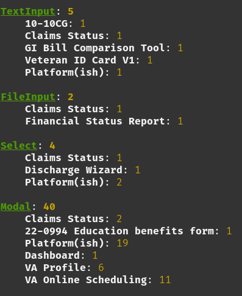
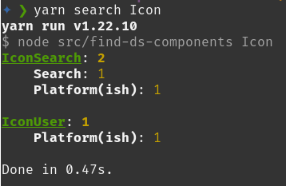
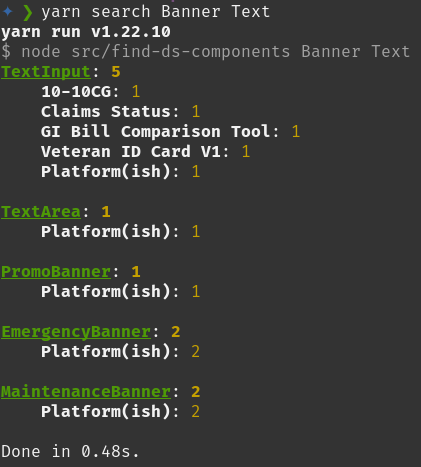

# Design System Dashboard CLI

Hello and welcome!

This little tool is used by the VA.gov design system team to gather metrics on
design system usage. For now, it's a simple CLI which may be used to output
formatted text to the terminal or a CSV file.

## Usage

Before you can use this tool, you'll need the following:

1. NodeJS
1. `vets-website` checked out in a sibling directory
   - If `design-system-dashboard-cli` is found at
     `path/to/design-system-dashboard-cli/`, then `vets-website` is expected at
     `path/to/vets-website`
   - This is configurable by modifying `.env.json`
     - Just be sure not to commit any change you make that are unique to your system

Get started by running `yarn` to install the dependencies, and you're off!

**Important:** This tool searches your local copy of `vets-website`, so make
sure it's on the `main` branch and has the latest changes!

### Add the latest usage data to BigQuery

First, make sure your terminal working directory is set to the root of the component-library repo. Then, make sure whatever branch you are working on is up-to-date with the latest from the `main` branch. The easiest way to do this is to stash any unsaved changes (`git stash`) and checkout main (git checkout main) followed by pulling down the latest from GitHub (git pull).

Once your codebase is up-to-date, run this command from the root directory:

```sh
./update-component-usage.sh
```

This will go to each of the necessary packages within the component-library repo and run "yarn install" followed by "yarn build" for each. For the web-components package, "yarn build:bindings" is also run. Finally, the script will navigate to the design-system-dashboard-cli folder and run "yarn report".

This will emit to `stdout` an `INSERT INTO` query for adding the newest values
to the table in [BigQuery](https://console.cloud.google.com/bigquery).

**Note:** If you don't have access to BigQuery, you'll need to request it.
Search for Domo in the [GitHub Issue
Templates](https://github.com/department-of-veterans-affairs/va.gov-team/issues/new/choose)
to get access to both Domo and BigQuery.

This will also create a new file in the root directory with a file name like "component-apps-and-owners-{today's date}.csv". This is used to track which React components have been deprecated but which are still in use in production. This file includes which component is in use, in which application, and who the 'owner' of that app is, within both the vets-website repo and the content-build repo.

### Generate a CSV report

To run the following yarn commands, make sure you are in the design-system-dashboard-cli folder, rather than the component-library root folder.

```sh
yarn report:csv [--output path/to/file.csv]
```

If you don't specify an `--output`, it defaults to
`ds-components-<YYYY-MM-DD>.csv`.

### Search for usage of specific components

```sh
yarn search
```

This will log all the uses of the design system components to the terminal like
so:



```sh
yarn search [search_terms...]
```

If you supply search terms, it'll filter the result.



**Note:** Search terms are case sensitive!

Search terms may be regex.

```sh
yarn search '^Telephone$'
```


You may supply multiple search terms.

```sh
yarn search Banner Alert
```



### Generate a report of forms library applications

Specifically, these commands will generate a report of applications that use the
`RoutedSavableApp` component.

To find a report of just the _number_ of forms, run

```sh
yarn forms
```

If you want to see what they are, you pass `--list` or `--table`.

```sh
yarn forms --list
```

```sh
yarn forms --table
```

To generate a CSV file with the list, use

```sh
yarn report:forms
```

### Generate a report of non-form applications using parts of the forms library

To see which applications use the forms library do _not_ use `RoutedSavableApp`,
run

```sh
yarn forms-library-usage
```

To see the individual files which import from the forms library, pass the
`--verbose` flag.

```sh
yarn forms-library-usage --verbose
```
